<div align="center">

# 像素校园 · Pixel Campus

**北京交通大学 · 一砖一瓦用代码画出来的校园**

[](#-校园里有什么)
[](#-校园里有什么)
[](#-一个文件装下全部)
[](#-自己跑一份)
[](#-许可)

**🎮 [进校园逛逛](play.html)　·　🏛 [思源楼场景](siyuan.html)　·　📄 [直接打开地图](像素校园_全校地图.html)**

</div>

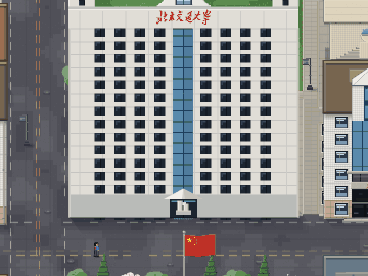

> 上面这段不是录屏软件截的，是脚本钻进页面里、一帧一帧渲染出来的 —— 所以它是**真的在跑**。

---

## 这是什么

一个 **单文件网页**。打开它，你会站在一座能走动的像素校园里。

没有游戏引擎，没有素材图，没有构建步骤，没有依赖。整座校园 —— 楼、树、马路、湖、网球场的白线、图书馆屋顶的红瓦、明湖里划水的鸭子 —— 全都是浏览器里当场用 `canvas` 画出来的：一块一块拼像素，一行一行写坐标。

```
5208 × 2929 世界像素  ·  41 个地标  ·  5 个校门  ·  4 个可辨认的角色
18,000+ 行代码，装在一个 1.18 MB 的 .html 里
```

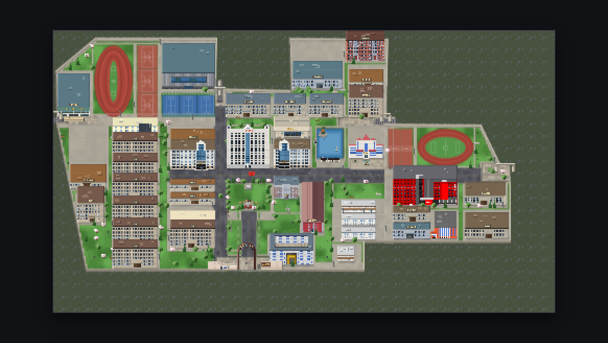

*西边老操场与篮球场、中间明湖与教学区、东边田径场和逸夫楼 —— 一次截完整的校园*

---

## 🚶 校园里有什么

<div align="center">

| | |
|---|---|
| 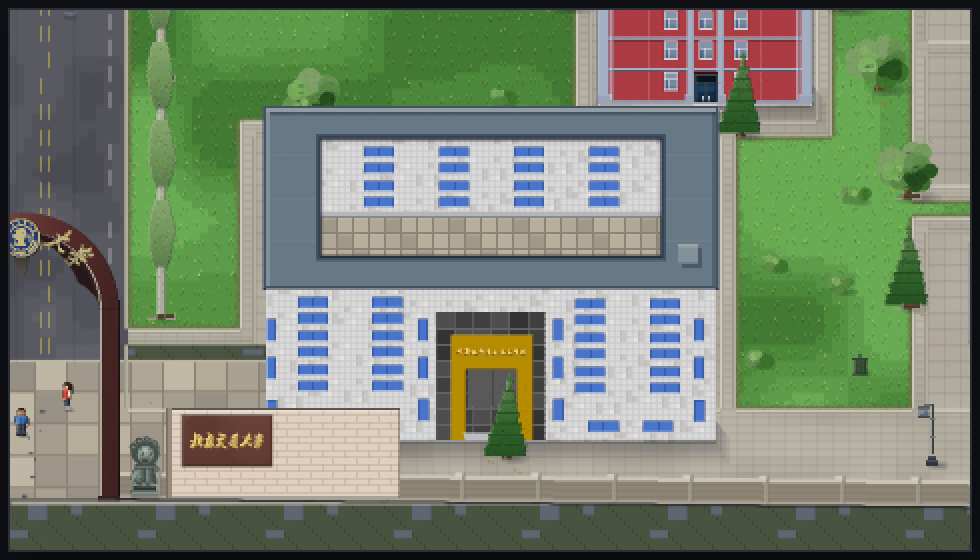 **第九教学楼** · 口字形天井、金门洞，旁边是校名石与詹天佑像 | 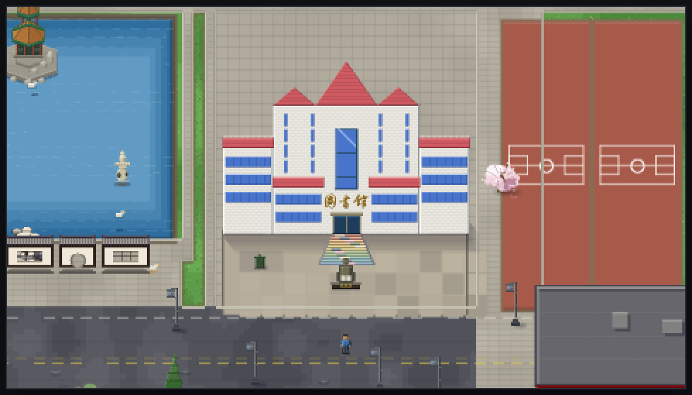 **图书馆** · 明湖、小船、雕像，西侧一排网球场 |
| 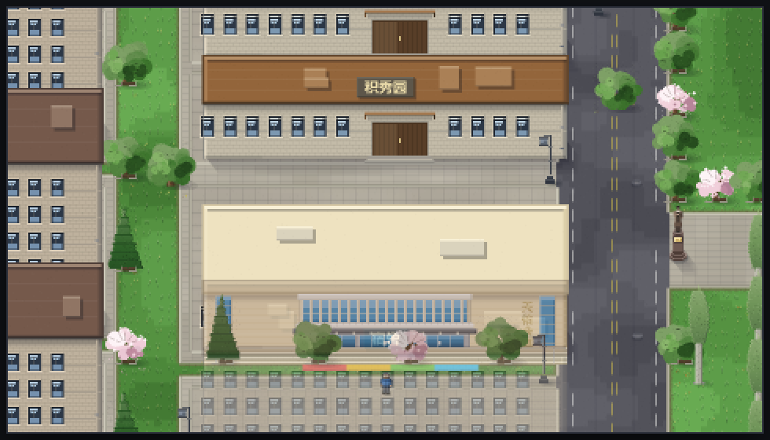 **天佑会堂** · 玻璃门厅，背后是积秀园 | 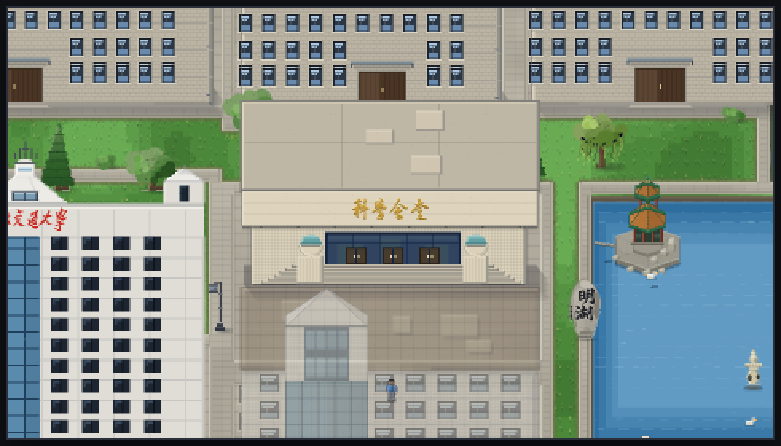 **科学会堂** · 明湖东岸那一栋 |
| 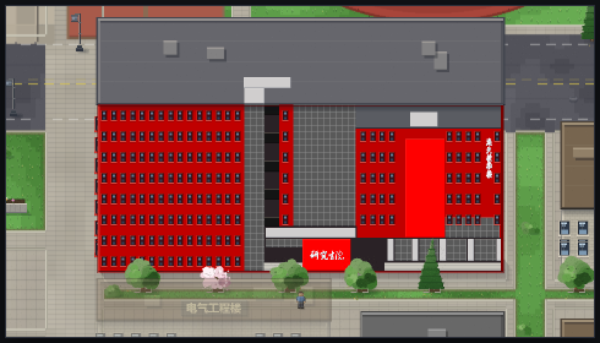 **逸夫楼** · 整面红瓷砖，**可以走进去** | 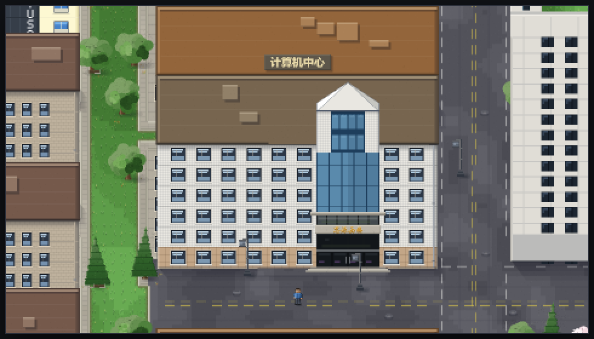 **计算机中心** · 进门就是机房教室 |
| 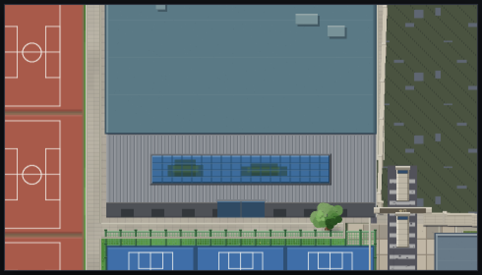 **新体育馆** · 大屋顶，外面一圈球场 | 五个校门：**西门 · 南门 · 东南门 · 东门 · 北门** |

</div>

---

## ✨ 能玩什么

### 🚶 真的能走

方向键 / WASD 自由行走。鞋底是**踩在世界坐标上**的，不是飘在半空；碰到楼、树、围墙、湖，统统走不过去。

### 🔍 九档缩放

从「一屏看完整座校园」到 3× 贴脸看。滚轮、右下角滑条、`+` `−` 都行。按 `0` 看全图、按 `1` 回原尺寸。
档位是**故意离散**的 —— 像素画连续缩放只会糊。

### 🌫 走到楼后面，楼会虚化

人被楼挡住的时候，那栋楼自动淡下去，你始终看得见自己在哪。

### 🧭 向导「小北」

南门口那位**红马甲志愿者**。按 `E` 跟她说话，然后直接说人话：

> 「带我去图书馆」「五教在哪」「我想去一食堂」

她**真的会沿着路把你走过去** —— 不是传送，是走。沿途要绕开草坪、贴着人行道，走不动了她会自己重新算路。

<div align="center">

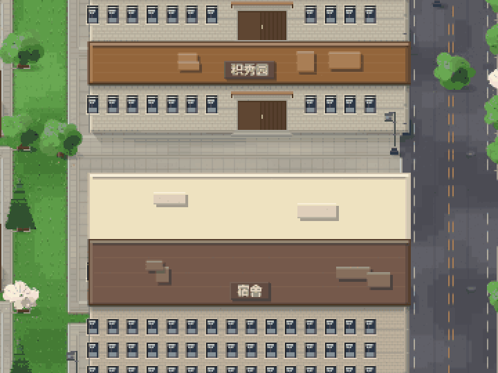

*校园巡游：宿舍区 → 思源楼 → 明湖 → 图书馆*

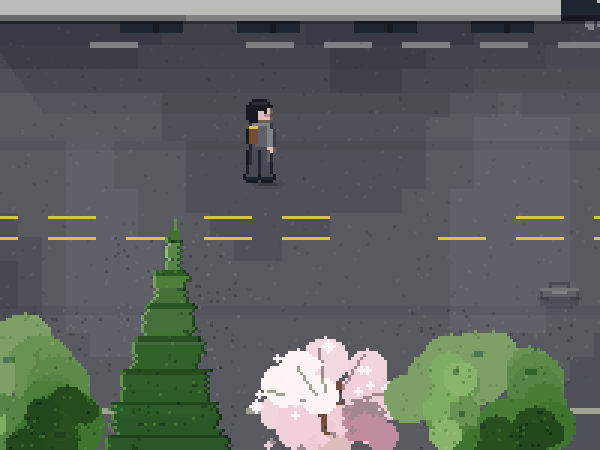

*1× 档贴脸看：四个方向各走一段，走完回到原点（所以能无缝循环）*

</div>

### 🖥 楼能走进去

**计算机中心**和**逸夫楼**有室内场景。走到门口按 `F` 进楼：

- 进教室、坐下，跟屋里的人说话（按 `C`）
- **计算机中心**的电脑打开的是**刷题平台**；**逸夫楼**的电脑打开的是**学霸**（能查教材、能一步步讲题）
- 按 `B` 出门，**回到你进门时站的那个位置**，不会瞬移

### 📦 一个文件装下全部

整个校园就是一个 `.html`。双击即开，不联网也能跑，扔 U 盘里发给同学也不会少东西。

---

## 🎮 操作

| 动作 | 键 |
|---|---|
| 左右移动 | `←` `→` 或 `A` `D` |
| 前后移动 | `↑` `↓` 或 `W` `S` |
| 缩放 | `滚轮` / `+` `−` / 右下角滑条 |
| 看全图 / 回原尺寸 | `0` / `1` |
| 和向导说话 | 走到小北身边按 `E` |
| 走进楼里 | 走到门口按 `F` |
| 室内 · 跟人说话 / 出门 | `C` / `B` |

---

## 🚀 自己跑一份

```bash
git clone -b main https://github.com/24301001/campus_game.git
cd campus_game
```

**最省事**：双击 `像素校园_全校地图.html`。

**最稳**：起个本地服务器（浏览器对 `file://` 有些限制）：

```bash
python -m http.server 8000
# 然后打开 http://localhost:8000
```

> [!NOTE]
> 向导「小北」的自然语言理解要调用大模型（DeepSeek），**需要自备 API Key**。
> Key 只存在你自己浏览器的 `localStorage` 里，**不会上传到仓库**。
> 不填也能正常逛校园，只是她听不懂你说话。

---

## 🌐 同门兄弟

这个仓库不止一张地图，另外几个分支各有各的模块：

| 分支 | 是什么 |
|---|---|
| **`main`** | 像素校园全校地图（就是本页这个） |
| **`wr`** | 算法刷题平台：题库、判题机、后端 8081 + `/api` |
| **`hjy`** | 保安老丁：出入管理的服务模块 |
| **`xueba-jie`** | 学霸：能查教材、能一步步讲题的课程助手 |

地图不是孤立的 —— 走进**计算机中心**或**逸夫楼**，教室里的电脑会直接嵌进上面这些模块。
两个模块都走**同源代理**（`/agent` 与 `/xbg`），所以 iframe 一加载就是登录态，不用在教室里再登一次。

---

## 📐 一些数字

| | |
|---|---|
| 世界尺寸 | 5208 × 2929 世界像素 |
| 地标 | 41 个 |
| 校门 | 5 个（西门 / 南门 / 东南门 / 东门 / 北门） |
| 缩放档位 | 9 档（看全图 → 3×） |
| 角色 | 4 个（玩家 / 小北 / 算法哥 / 学霸姐） |
| 代码 | 18,327 行，单个 HTML |
| 体积 | 1.18 MB |
| 依赖 | 0 |

---

## 📄 许可

MIT。校园是画着玩的，欢迎来逛、来改、来加自己的楼。

<div align="center">
<sub>像素校园 · 北京交通大学 ｜ 每一栋楼、每一棵树、每一个像素，都是代码画的</sub>
</div>
